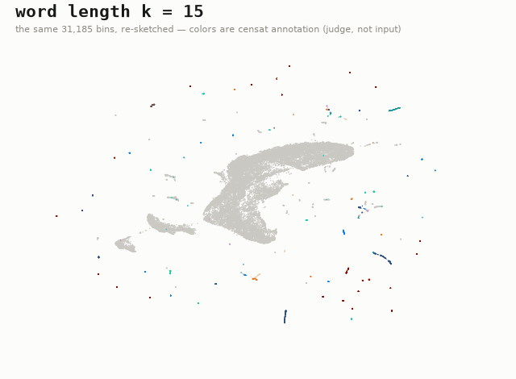
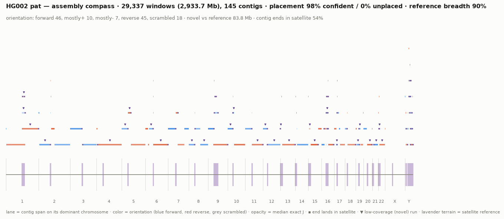
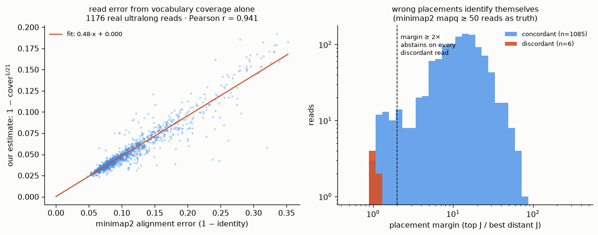
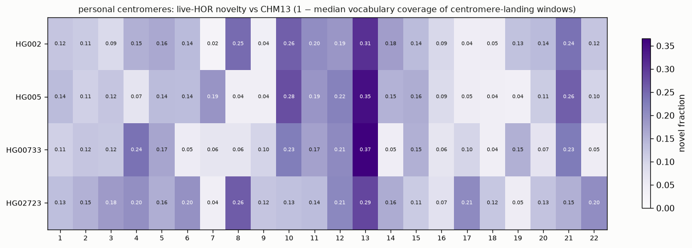
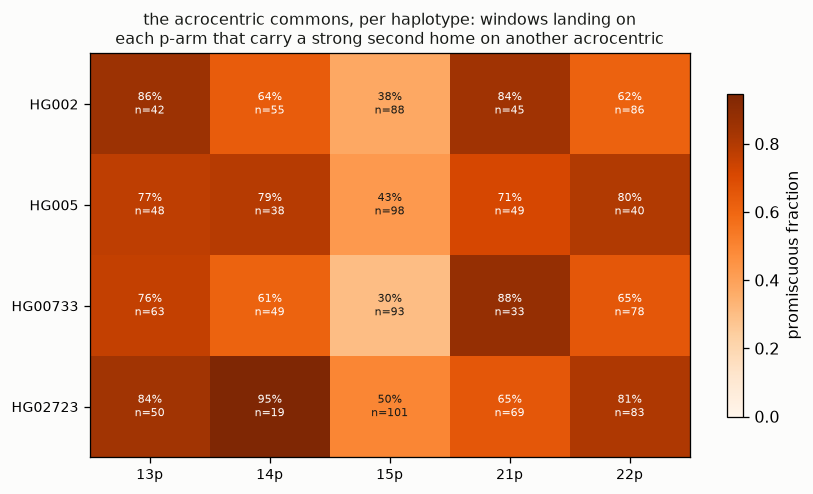
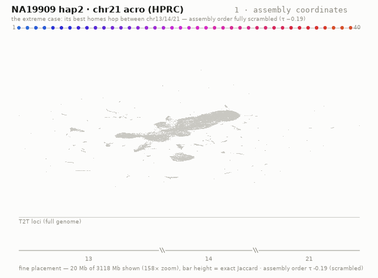
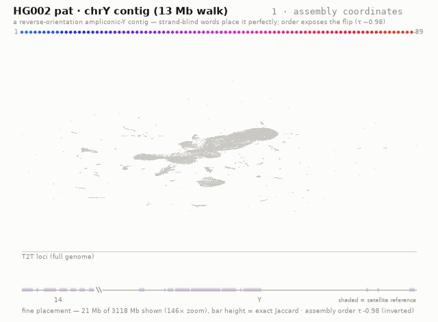

# kmer_clust

**A map of the complete human genome in which position is decided purely by k-mer
vocabulary.** No aligner, no reference coordinate, no orthology. Every dot is a
100 kb bin of T2T-CHM13v2.0; bins land next to each other because they use the
same words.

**→ The interactive atlas: [`docs/index.html`](docs/index.html)** (deployed to
GitHub Pages by [`pages.yml`](.github/workflows/pages.yml)).



*The same 31,185 bins re-sketched at every word length from k=15 to k=25 —
word length is a composition↔homology dial, and the satellites hold station
throughout. Colors are censat annotation, which judges the map and never
builds it.*

This repo is the deliberately-narrow successor of
[kmer_dust](https://github.com/jlanej/kmer_dust): one genome, one sketch engine,
two analysis tracks, one self-contained report. Where kmer_dust spanned 463 HPRC
assemblies with 10 kb bins at scaled=200 (~50 hashes per bin — its own
representation study found satellite bins vocabulary-starved at ~27), kmer_clust
inverts the trade: **100 kb bins at scaled=20**, roughly 250× more hashes per
bin-pair comparison, deep enough that pairwise distances stop being estimates.

## The pipeline

```
chm13v2.0.fa.gz
   │  fasta.py       stream → 2-bit codes, cached per chromosome
   ▼
sketch (fracminhash.py, numba)          ~160 s for 3.1 Gbp on an M1 Max
   │  canonical 21-mers → MurmurHash3-x64-128(seed 42) → keep h ≤ 2⁶⁴/scaled
   │  bit-identical to sourmash (tested against it), with per-bin multiplicities
   ▼
sketch store  data/sketch_k21_s20_bin100000.npz
   │  (bin → sorted unique hashes + counts; every coarser scaled and larger
   │   bin size is derived from this store without touching sequence again)
   │
   ├── Track A: the model ──────────────────────────────────────────────
   │     matrix.py   bins × shared-hashes (scaled=50, df≥2), log1p(count)·IDF, L2
   │     gram_rsvd   randomized subspace SVD on the implicit Gram operator
   │     embed_run   UMAP (cosine) 2-d display + 12-d clustering space
   │                 HDBSCAN → clusters, named after the fact by annotation
   │
   └── Track B: the ground truth ──────────────────────────────────────
         pairwise.py  bins boosted to 1 Mb (union of children); one sparse
                      matmul → exact Jaccard & max-containment for all pairs;
                      cANI = C^(1/k); average-linkage + optimal leaf ordering;
                      HDBSCAN(metric=precomputed); UMAP(precomputed)

annotate.py   censat v2.1 (+ segdup, RepeatMasker, telomere) → per-bin fractions
analyze.py    metrics, the two-way acrocentric test, robustness sweeps, A/B accord
figures.py    static analytical panels
site.py       everything → one self-contained docs/index.html (no CDN)
```

Run it:

```bash
python3.11 -m venv .venv && .venv/bin/pip install -e .[dev]
make test     # sketch engine is verified bit-identical to sourmash
make all      # sketch → matrix → embed → pairwise → annotate → analyze → figures → site
```

Everything runs on one laptop. Data lands in `data/` (~2 GB incl. the genome),
results in `out/`, the site in `docs/`.

## Design decisions (and why)

- **FracMinHash, sourmash-compatible.** The engine is ~200 lines of numba, but
  the hash function, canonicalization, and keep-rule are bit-identical to
  sourmash (enforced by `tests/test_fracminhash.py`), so sourmash's
  Jaccard/containment/ANI theory applies unchanged and sketches are
  interchangeable.
- **One dense store, many views.** The base sketch (scaled=20, 100 kb bins,
  with multiplicities) is written once; scaled=50/100/200 and 1 Mb bins are
  subsets/unions of it. FracMinHash's containment property makes downsampling a
  threshold cut.
- **Private vocabulary is a feature, not a column.** Hashes seen in only one
  bin (most of euchromatin) carry no between-bin signal; they are dropped from
  the model, and each bin's private fraction is kept as a diagnostic — the map
  can be colored by it.
- **Abundance kept, IDF kept mild.** Satellite arrays express identity through
  multiplicity of few words (kmer_dust's study: within-bin dedup discards ~74%
  of live-HOR signal, and reproducibility *rises* with copy number), so weights
  are log1p(multiplicity) × log1p(N/df).
- **Clusters come from a 12-d UMAP space, display from 2-d.** And a 4×3
  HDBSCAN parameter sweep is part of the report, so "how many clusters" is
  presented as the parameter-dependent quantity it is.
- **Annotation judges, never builds.** censat/RepeatMasker/segdup tracks color
  and score the finished map; they contribute nothing upstream.

## What the map should show — and does

- **The two-way acrocentric test** (design borrowed from kmer_dust): alpha-HOR
  bins should be *identifiable by chromosome* from vocabulary alone
  (HOR arrays are chromosome-specific), while rDNA bins should be
  *chromosome-confused* (the arrays recombine across the five acrocentrics).
  A method that secretly encodes position passes the first and fails the
  second; a method blind to fine vocabulary fails the first. kmer_clust passes
  both — and the single largest alpha-satellite confusion is chr5↔chr19,
  within the S1C1/5/19 HOR family those chromosomes genuinely share
  (23 of 56 errors fall inside the chr1/5/19 family).
- Satellite families (HSat1A/1B/2/3, alpha live/divergent/monomeric, beta,
  gamma, rDNA) reassemble from across the genome into coherent islands.
- The euchromatic mainland organizes by repeat dialect and GC, with segdup-rich
  bins forming their own reefs; Yq12's HSat1B/HSat3 continent dominates the
  satellite hemisphere.
- Track A (cosine in the SVD model) and Track B (exact Jaccard at 1 Mb) rank
  pairs the same way — measured, not assumed.
- The exact-distance matrix is explorable: annotation margins (chromosome +
  satellite class), zoom/pan to single-pair resolution, and click-a-pair to
  light both loci up on the map and territory (e.g. one click on an
  off-diagonal speck reads: chr13 rDNA × chr21 rDNA, Jaccard 0.256).

Headline numbers from the shipped run (full details in `out/metrics.json` and
on the atlas page):

| what | result |
|---|---|
| bins / clusters / noise | 31,185 · 133 · 33.3% |
| satellite-cluster purity (size-weighted) / recovery | 90.7% / 90.4% |
| αSat HOR bin → chromosome, leakage-free¹ (chance) | **92.0%** (7.9%) |
| rDNA bin → chromosome — the predicted weak side¹ (chance) | 70.4% (35.7%) |
| satellite family recovery, leakage-free¹ (chance) | **96.8%** (29.0%) |
| satellite semantic accuracy across 4 UMAP seeds | 94.3–94.4% every seed |
| satellite semantic accuracy at half / quarter sketch depth | 96.3% / 96.4% |
| HDBSCAN agreement at comparable granularity (full 10× grid) | ARI 0.61 (0.34) |
| model vs exact distance, 1 Mb pairs (Spearman) | ρ 0.54 |
| live-HOR bins: tandem period from hash spacing alone | **1,364 bp = 7.99 × the 170.8 bp monomer** (85% periodic) |
| rDNA bins: tandem period from hash spacing alone | **44.8 kb** (the ~45 kb unit) |
| mainland dialect R² (unified 12-D protocol): k=21 → k=17 | 0.465 → **0.525** (satellites intact) |
| consensus k17⊕k21: dialect R² / HDBSCAN noise | 0.512 / **2.2%** (vs 33.3% baseline) |
| info k15⊕k21 / k=15 alone: dialect R² | 0.585 / 0.661 (composition end) |

¹ classification is a similarity-weighted vote among cosine neighbors with
same-chromosome bins within ±5 bins **excluded**, so a bin's own array cannot
vote for it — no adjacency leakage. (The naive CV formulation scored 95.7% on
αSat; removing the leakage costs under 4 points — the signal is cross-array,
not positional.)

The raw k=15 neighbor-overlap numbers under reseeding/subsampling are low
(0.11–0.24) — and that is the honest reading of a dense euchromatic mass whose
neighbors are legitimately interchangeable; the semantic quantities above are
the stable object. Runtime on the M1 Max: sketch 157 s, matrix+SVD 33 s,
UMAP+HDBSCAN 76 s, exact pairwise 117 s, full analysis 282 s.

## Finding more structure (annotation-free levers)

Two additions keep the build annotation-agnostic while articulating the map:

- **Tandem periodicity** (`periodicity.py`, `make periods`): within one bin, the
  same kept hash recurring every P bases is the signature of a tandem array
  with unit ~P. The dominant gap per bin becomes a color mode and a tooltip
  stat. Judged after the fact: live alpha-HOR bins land at 7.99× the 171 bp
  monomer and rDNA at its 45 kb unit — from spacing statistics alone.
- **The structure lab** (`structure_lab.py`): a whitening sweep over SVD
  component scaling plus a second k=17 vocabulary (shorter words let diverged
  repeat copies share again). Verdict: whitening at α≈0.35 collapses HDBSCAN
  noise (33%→2%) without adding information; **k=17 adds real euchromatic
  signal** (+14% dialect R², satellites improve); the k21⊕k17 concatenation
  gets both. The atlas ships the winners as morphable embedding views —
  satellite-health-gated, baseline always default.
- **The acrocentric commons** (`analyze.acro_analysis`, atlas mode
  "acro p-arms"): for every p-arm bin of chr13/14/15/21/22, the fraction of
  its nearest vocabulary neighbors (own-array adjacency excluded) that come
  from a *different* acrocentric. Mean cross-acro mixing is 57% and
  neighbor-vote chromosome assignment only 45.7% — the assembly difficulty of
  these arms, quantified bin by bin. The structure is uneven and specific:
  non-satellite p-arm sequence is 88% interchangeable (the pseudo-homologous
  region), hsat1B 92%, while hsat3 (35%) and rDNA (43%) retain identity;
  13p and 15p carry large chromosome-knowing blocks while 14p/21p/22p are
  mostly commons. The atlas colors arms by chromosome, desaturated by mixing.
- **The thread through word-space** (`atlas3d.html`, prototype): a 3-D panel
  where the genome runs left→right and the current embedding plane rotates
  around it — chromosome threads dive from the mainland into their satellite
  islands, and a ▶ fly mode walks the genome with the map and territory
  tracking in sync. Genome-wide or single-chromosome. Deliberately modular:
  one fragment file injected at a template marker, reading the page's live
  state (so it inherits every color mode, selection, and the k slider);
  deleting `kmer_clust/atlas3d.html` removes the feature entirely.
- **The k-ladder** (`kladder.py`): one full re-sketch and embedding per word
  length k ∈ {15,17,19,21,23,25}, each layout Procrustes-aligned to k=21 and
  quantized in a shared frame, so the atlas can expose **k as a slider** that
  morphs the map through vocabularies (with per-k judge metrics displayed
  live). k=15 is included deliberately — 4¹⁵ is about the genome's own size,
  so the slider lets you watch the random-collision floor arrive.
- **Multi-k vocabularies** (`multik_lab.py`): paired views concatenate two
  per-k models, each block L2-normalized so the pair's cosine is exactly the
  mean of the two vocabularies' cosines. Measured verdict: adjacent horizons
  agree and sharpen clusters (**consensus k17⊕k21**: dialect R² 0.51, 2.2%
  HDBSCAN noise in the shipped run); complementary horizons maximize information at the cost of
  flat-cluster confidence (**info k15⊕k21**: R² 0.59, best-organized
  euchromatin); concatenating all six k's is dominated by both — redundant
  middle horizons average the ends away. Both winners ship as atlas views.

## Triage: the assembly compass

The first DIRECTIONS use case, shipped:

```bash
python -m kmer_clust.project triage <assembly.fa.gz> "<label>"
```

One cached scan (~5 min fresh, seconds cached) produces a per-contig
table (`out/triage_<tag>.tsv` + JSON), a console summary, and a one-page
compass figure: every contig painted onto the reference at its dominant
chromosome span, colored by orientation (sign of τ), opacity by median
exact J, satellite terrain shaded, low-coverage (novel) runs and
satellite-terminated ends marked.



Headline numbers for the two year-1 drafts: HG002-pat — 98% of windows
placed confidently, reference breadth 90%, orientation census 46 forward
/ 45 reverse (contig strand is arbitrary; the compass makes it visible),
83.8 Mb below coverage 0.9, and **54% of contig ends land in satellite**
— "death by satellite," previously an anecdote, now a statistic.
HG005-pat: 99% confident, 60.2 Mb novel, 41% satellite ends. The table
reproduces every hand-established finding automatically (the chr13
q-arm contig: reverse, τ −1.0, satellite-terminated, novelty run
96.1–97.4 Mb at min coverage 0.55 — the centromere entry, rediscovered
by triage) and surfaces new review candidates (a 59-window contig at
58% dominant-chromosome, τ −0.4, 5 order jumps). Compared to standard
QC: needs no reads (unlike Merqury), no alignment (unlike Flagger), and
reads orientation and order — the balanced events coverage-based tools
state they cannot see.

## Benchmarks: the claims, quantified

`python -m kmer_clust.bench all` (`out/bench_*.json`) turns the triage
and recruitment claims into numbers, on synthetic truth cut from CHM13
itself (spans offset 50 kb from the bin grid so no window equals a
training bin; euchromatic and satellite strata; seeds fixed).

**Misassembly detection** — 30-window synthetic contigs corrupted with
an inverted middle block, an interchromosomal misjoin, or a distant
intrachromosomal misjoin, read back through the projector with two
alignment-free statistics (adjacent-placement jumps; most-negative
sliding-window τ):

| stratum | inversion | interchrom misjoin | intrachrom misjoin |
|---|---|---|---|
| euchromatin | AUC 0.999 · 98% at 0% FPR | AUC 0.976 · 100% at 2% FPR | AUC 0.978 · 100% at 2% FPR |
| satellite | AUC 0.947 · 80% at 0% FPR | AUC 0.703 (not usable¹) | AUC 0.573 (not usable¹) |

¹ honest boundary: intact satellite contigs already "jump" between array
positions (57% control FPR), so the naive jump rule cannot call satellite
misjoins — while **inversion detection keeps working inside satellite
DNA**, exactly the balanced-event terrain where coverage-based QC tools
state they cannot operate.

**Ultralong-read recruitment** — CHM13 fragments at 50/100/200 kb with
uniform substitution errors at ONT-like rates, random strand:

| stratum | error | top-1 bin | **chromosome** | median J | cover |
|---|---|---|---|---|---|
| euchromatin | 0 / 2 / 5% | 98–100% | **100%** | 0.51 / 0.28 / 0.13 | 1.00 / 0.69 / 0.41 |
| satellite | 0 / 2 / 5% | 56–90% | **94–98%** | 0.66 / 0.22 / 0.10 | 1.00 / 0.62 / 0.45 |

Reads find their chromosome essentially always — including satellite
reads at 5% error, the centroFlye-style recruitment question answered
genome-wide with no markers and no HOR annotation. The coverage meter
simultaneously reads the error rate ((1−p)²¹ ≈ 0.65 at 2%, measured
0.69) — placement and quality estimation from the same sketch.

**Real ultralong reads** — the real test: 1,200 reads ≥ 50 kb streamed
from the GIAB HG002 ultralong PromethION run (2019 basecalls — median
alignment identity 0.90, i.e. **~10% real error**), each placed by the
projector (9 ms/read) and by minimap2 map-ont (~80 ms/read) against the
same CHM13 (`python -m kmer_clust.bench_real`):

- Where minimap2 is confident (mapq ≥ 50, non-satellite; n = 1,091):
  **99.4% chromosome and 98.8% bin-level (±1 window) concordance.**
- All 6 discordant reads **identify themselves**: their placement margin
  (top J vs best distant J) is ≈ 1× versus a median 12.5× for correct
  calls — a margin ≥ 2× rule abstains on every one of them.
- The 24 reads minimap2 cannot align at all read as 11–28% error on our
  coverage meter — independently flagged as junk, with the reason.
- Satellite-landing reads: only 25% get minimap2 mapq ≥ 20 (the
  documented collapse, live), while our placements agree with minimap2's
  best guess at 84% chromosome-level.
- **The error meter**: per-read error estimated from vocabulary coverage
  alone, err = 1 − cover^(1/21), tracks minimap2's alignment identity at
  **Pearson r = 0.941** with fit 0.48·x + 0.000 — zero intercept; the
  slope reflects ONT error clustering (adjacent errors destroy shared
  k-mers), so one linear calibration makes the sketch a read-quality
  meter with no alignment and no basecaller QVs.



**Across haplotypes (pilot, n = 4)** — the population phase
(`python -m kmer_clust.population`), computed purely from the cached
scans of HG002, HG005, HG00733, and HG02723 paternal haplotypes:



- **Personal centromeres**: per sample × chromosome, the live-HOR
  novelty (1 − median vocabulary coverage of centromere-landing
  windows). **chr13 is the most novel centromere in all four
  individuals** (0.29–0.37); chr7/9/17/18 stay conserved; per-sample
  profiles correlate at mean r = 0.51 — a chromosome-intrinsic
  divergence rate with real individual variation on top (HG00733's
  chr4 and HG02723's chr17 are personal outliers). This is the
  Logsdon-style per-individual centromere divergence, read in seconds
  per haplotype with no HOR annotation and no alignment.



- **The acrocentric commons, per haplotype**: the fraction of each
  p-arm's windows carrying a strong second home (J₂ ≥ 0.5 J₁) on a
  *different* acrocentric. **15p is the most chromosome-specific arm in
  all four haplotypes** (30–50% promiscuous vs 61–95% elsewhere) —
  independently confirming, from the query side, the reference-side
  finding that 15p's distal arm is nearly all specific — while
  individual structure is real (HG02723's 14p at 95%). Per-window
  PHR-style cartography, comparable across any number of haplotypes.

The **assembly compass** panel in the atlas makes triage live: contigs
painted on the reference by orientation, hover for the full row, click
to light a contig's span up in the map, territory, and thread.

## Methods, precisely

Everything below is implemented in this repository; file names in
parentheses. Defaults: k = 21, seed 42 throughout.

**Sketching** (`fracminhash.py`). Sequence is 2-bit encoded (case-insensitive;
k-mers containing non-ACGT bases are dropped). Each k-mer is canonicalized to
the lexicographic minimum of itself and its reverse complement, hashed with
MurmurHash3-x64-128 (seed 42, low 64 bits), and kept iff
h ≤ int(float(2⁶⁴)/scaled) — the float-cast form reproduces sourmash's Rust
`(u64::MAX as f64 / scaled) as u64` bit-for-bit, and the test suite verifies
sketches against sourmash itself. The base store keeps, per 100 kb bin at
scaled = 20 (~5,000 kept hashes per bin): sorted unique hashes, per-hash
multiplicities, and k-mer start positions. Every other resolution is derived
without touching sequence again: coarser scaled by threshold cut (the
FracMinHash containment property), 1 Mb bins by set union of children.

**Track A — the model** (`matrix.py`, `embed_run.py`). At scaled = 50
(a threshold cut of the base store — exactly equivalent to sketching at 50
directly), the bins × shared-hashes matrix X has a column for every hash
with document frequency df ≥ 2; hashes seen in exactly one bin — most of
euchromatin — are excluded from the model and reported per bin as the
private fraction (a fraction of *distinct* vocabulary). Entries are
x_ij = log1p(c_ij) · log1p(N/df_j) with c the within-bin multiplicity and
N the bin count — a deliberately mild IDF. Rows are L2-normalized. A
rank-128 randomized subspace SVD (5 QR-stabilized iterations, Rayleigh–Ritz
on the implicit bin-side Gram operator X Xᵀ, applied in column blocks so
nothing larger than an n_features × 32 workspace is dense) yields bin
coordinates Z = UΣ, which preserve row-space geometry (ZZᵀ equals the
rank-truncated X Xᵀ). Display is UMAP (cosine, n_neighbors 30,
min_dist 0.08, seed 42) to 2-D; clustering is HDBSCAN
(min_cluster_size 25, min_samples 10) in a *separate* 12-D UMAP
(min_dist 0) of the same Z — clusters come from 12-D, the picture from
2-D, and cluster structure is a property of that embedding, as is standard
for UMAP+HDBSCAN. Cluster names are assigned after the fact from
annotation.

**Track B — exact distances** (`pairwise.py`). At 1 Mb (child-set unions,
base scaled 20), one sparse Boolean product yields all pairwise intersection
sizes; from them Jaccard J = |A∩B|/|A∪B|, max-containment
C = |A∩B|/min(|A|,|B|), and cANI = C^(1/k) are computed exactly over the
sketches (the sketch-level Jaccard itself remains a FracMinHash estimate of
sequence Jaccard, deep at ~5,000 hashes per 100 kb). GC is base-weighted
and computed over ACGT bases only. Average-linkage clustering with optimal
leaf ordering runs on 1−J; the heatmap displays J^(1/3) for contrast.

**Annotation judges, never builds** (`annotate.py`, `analyze.py`). censat
v2.1 (live HOR = `hor(...L)`), segdup, telomere, and RepeatMasker tracks are
reduced to per-bin coverage fractions and used only to color and score.
Classification scores use an adjacency-leakage-free protocol: a
similarity-weighted vote among the k = 10 nearest cosine neighbors in the
128-D SVD space, with all same-chromosome bins within ±5 bin positions
(±500 kb) excluded from the electorate. Chance baselines are the
majority-class rate of each task's label distribution. Stated precisely:
the exclusion removes local genomic adjacency, not array membership —
same-chromosome bins beyond 500 kb, including the continuation of the same
tandem array, may vote. For αSat → chromosome that long-range support *is*
the tested signal (a chromosome's HOR vocabulary exists only in its own
array); for satellite taxonomy, excluding entire chromosomes instead drops
accuracy from 96.8% to 82.2% — still 2.8× chance on cross-chromosome
recognition alone. (Mainland dialect R², the other half of the unified
view protocol, is regressed in the 12-D clustering embedding.)

**Tandem periodicity from hash spacing** (`periodicity.py`). FracMinHash
subsamples k-mer *types*, not occurrences: once a word wins the lottery,
every occurrence and its position is recorded. Within a bin, the gaps
between successive occurrences of the same word (both endpoints in-bin,
60 bp ≤ gap < 100 kb) therefore sample the true spacing between repeat-unit
copies. Per bin (≥ 15 gaps), gaps are histogrammed on an 89-band log grid
(~8.7% per band); the reported period is the median gap within the modal
band, and periodic strength is that band's share of all gaps. Gaps at
integer multiples of the unit arise when a word is mutated away in an
intervening copy, so the mode recovers the unit itself whenever
adjacent-copy word sharing dominates — the observed regime here. Detection
is bounded to [60 bp, 100 kb), with power falling as ≈ 1 − P/bin for
periods P approaching the bin size (relevant to the ~45 kb rDNA unit).
Recovered without annotation: live-HOR bins at 1,364 bp = 7.99 × the
170.8 bp alpha-satellite monomer; rDNA bins at 44.8 kb.

**The k-ladder and paired vocabularies** (`kladder.py`, `multik_lab.py`).
k ∈ {15…25} are full re-sketches. Layouts are Procrustes-aligned (centering,
rotation, isotropic scale) to the k = 21 frame and quantized into one shared
coordinate frame so the atlas can morph between them. Paired views
concatenate two per-k models, each block L2-normalized, so the pair's cosine
is exactly the mean of the two vocabularies' cosines.

**Projection of new assemblies** (`project.py`). The model is frozen: the
shared-hash universe, the IDF weights, the SVD basis, and (for the exact
side) the full store universe. A query window is sketched identically and
read through two deliberately separate signals:

1. *Word-space placement.* Query weights over the shared vocabulary
   (log1p(count) · IDF, L2) are folded in via V = XᵀZΣ⁻² — algebraically the
   right singular vectors — giving 128-D coordinates compared by cosine
   against row-normalized Z. Windows with fewer than 5 shared-vocabulary
   matches fall back to exact hits for display.
2. *Locus assignment.* The window's full sketch (private words included) is
   intersected with every bin's full sketch; exact set Jaccard — with novel
   query words counted in the union, penalizing J — ranks candidates. The
   top 8 hits are chained transitively into loci (same chromosome, gap ≤ 3
   bins); up to 3 loci are reported, ranked by best member J; fine placement
   is the J-weighted centroid of the best locus's member bins.

*Vocabulary coverage.* cover = the fraction of the window's kept hashes
present anywhere in the reference store. Because the keep rule is a
deterministic function of the k-mer, a kept query hash absent from the
reference implies the reference genuinely lacks that k-mer — cover is an
unbiased estimate of the fraction of the window's k-mers shared with the
reference, and doubles as a novelty detector (the chr13 centromere entry was found this
way; the KIR window's 20% novelty was read this way).

*Order (τ).* Windows are indexed along their assembly segment and painted by
that index. Kendall's τ_a between assembly index and position on the
composite fine axis (per-chromosome [min, max] ± 2 Mb segments at one
uniform Mb-per-pixel scale; placements within 10 kb — a tenth of a window —
count as tied and contribute 0) scores collinearity:
|τ| ≥ 0.85 collinear (inverted if negative), ≥ 0.5 mostly ordered, else
scrambled. This is a synteny readout with no aligner: parallel ribbons =
collinear; one full crossing = a reverse-stored contig; a weave = the
acrocentric commons.

*Validation.* Self-projection of T2T windows offset 50 kb from the bin grid
(so no query equals a training bin; truth = the window's two overlapping
bins): exact top-1 97% / top-3 99% on euchromatin, 70% / 92% on
satellite+acrocentric; shared-vocabulary cosine alone achieves 30% top-1 —
the measured reason locus assignment uses the exact signal. The CHM13
self-slice control scores J = 1.000 median and τ = +1.00; for
assembly-grid windows, offset geometry alone caps exact J at f/(2−f) for
overlap fraction f.

*Set construction.* A whole haplotype is scanned as every 100 kb window with
≥ 10 kept hashes (~29–30 k windows, ~10 ms each via gathered sparse ops;
cached as parquet). Region showcases keep windows whose top-1 exact hit bin
falls in a named region, take the contig with the most such hits, and fill
the contiguous span between its first and last hit; sets exceeding 44
windows are trimmed to the contiguous run maximizing in-region hits (never
interior-dropped), and the trim is disclosed on the assembly axis.
One-contig chromosome sets pick, among contigs with ≥ 15 top-1 hits on the
target chromosome, the one maximizing hits × reference span walked,
excluding contigs already featured in another set (over 120 windows:
uniform thinning, disclosed). Hand-cut walks (the chr13 centromere entry)
are declared with their discovery rule — that one was the global
lowest-coverage contiguous megabase of the whole scan. Region coordinates
are anchored on genes located in hs1 via UCSC's catLiftOffGenesV1 track —
never lifted from GRCh38 by memory.

**Display conventions** (`gifs.py`, `template.html`, fragments). The
word-space station draws a query at the similarity-weighted center of its
cosine hits (weight 1/(1.0001−s)) — a display device only; no metric uses
it. The fine axis excises unmatched chromosomes but preserves one uniform
scale, with the zoom factor (genome Mb / shown Mb) printed. Satellite
shading under the axis is censat annotation in its judging role.

**Limitations.** 100 kb windows set the resolution floor (KIR-scale
paralogy is sub-window); exact J between offset grids is bounded by
f/(2−f) even at perfect identity; the model deliberately excludes private
vocabulary, so locus identity rests on the exact track; when a set spans
chromosomes, cross-segment window pairs (35–60% of pairs in the
acrocentric slices) are ordered by chromosome index on the composite axis,
so τ there mostly scores *which chromosome* each window claims — the
intended commons readout, but not pure within-chromosome synteny;
judged metrics inherit annotation quality; the HPRC inputs are year-1
drafts, and several findings (fragmented Y, reverse-stored contigs, a
contig dying in the centromere) are properties of those drafts, reported
as such.

## Repo layout

| path | what |
|---|---|
| `kmer_clust/fracminhash.py` | numba FracMinHash engine (murmur3, canonical k-mers, per-bin stats) |
| `kmer_clust/sketch_run.py` | genome → sketch store |
| `kmer_clust/matrix.py` | store → weighted sparse matrix → low-memory randomized SVD |
| `kmer_clust/embed_run.py` | UMAP + HDBSCAN |
| `kmer_clust/pairwise.py` | 1 Mb exact pairwise distances, linkage, precomputed clustering |
| `kmer_clust/annotate.py` | censat/segdup/RepeatMasker/telomere → per-bin fractions |
| `kmer_clust/analyze.py` | metrics, two-way test, robustness sweeps, A/B accord |
| `kmer_clust/periodicity.py` | per-bin tandem period from kept-hash spacing |
| `kmer_clust/structure_lab.py` · `kladder.py` | annotation-free structure experiments; k-slider views |
| `kmer_clust/figures.py` | static panels |
| `kmer_clust/site.py` + `template.html` | the self-contained interactive atlas |
| `tests/` | sourmash bit-parity + toy-scale math checks |

## Data

- Genome: [T2T-CHM13v2.0 analysis set](https://s3-us-west-2.amazonaws.com/human-pangenomics/T2T/CHM13/assemblies/analysis_set/chm13v2.0.fa.gz) (downloaded by `make all` if absent)
- censat v2.1, segdup, telomere BEDs: cached in `data/` (originals from the
  [T2T CHM13 annotation bucket](https://github.com/marbl/CHM13))
- RepeatMasker 4.1.2p1 BED: read from a sibling `kmer_dust/data/cache/` checkout
  if present; optional (TE fractions are skipped without it)

## Projection (prototype)

`project.py` (`make project`) freezes the model — shared-hash universe, IDF,
SVD basis — and drops any assembly's 100 kb windows onto the map with **two
signals on purpose**: model cosine in the shared-vocabulary space places a
window in word-space (its dialect neighborhood), while **exact sketch Jaccard
against the full store** (private words included) decides its loci — because
euchromatic locus identity lives precisely in the private vocabulary the
model excludes. Self-projection of 50 kb-offset T2T windows: **97% top-1 /
99% top-3** on euchromatin and 70% / 92% on satellite+acrocentric (residue =
within-array ties), with cosine alone managing only 30% — the gap is the
point. Projected 4 Mb chr21-acrocentric slices of HG00097 (both haplotypes)
and NA19909: the CHM13 control maps 40/40 windows to chr21, while the HPRC
haplotypes send 20–70% of their windows to chr13/chr14 as best exact home —
the pan-acrocentric commons, measured per window, with runner-up loci and
vocabulary coverage (95–98%) carrying the ambiguity. The atlas gains a
four-stage morphing panel: assembly coordinates → word-space placement →
T2T loci (dots lifted into lanes, solid stem to the best locus, thin stems
to runner-ups) → fine placement on an auto-zooming excised axis: only the
matched chromosomes remain, spanning the placements' min–max (+2 Mb), at
one uniform px-per-Mb scale with break marks, a scale bar, an "N× zoom"
readout, and a per-window exact-Jaccard bar. Click pins a window
(world-line through all four stations, loci lit in the main views); a
"paths" toggle draws every world-line at once, and "zoom locus" opens
per-locus J-bar detail for the pinned window. Modular as `project.html`,
delete to remove.



*NA19909's chr21-acrocentric slice touring the four stations, closing on
the world-line finale and the direct assembly↔placement ribbon. Its fine
placements land on an excised chr13 ∥ chr14 ∥ chr21 axis at 158× zoom —
most of this haplotype's "chr21" slice finds its best exact home on
CHM13's chr13.* (Control: [tour_chm13_slice.gif](docs/media/tour_chm13_slice.gif),
one contiguous chr21 segment at 395×.)

### Showcase: famous loci, fished out of a whole haplotype

To stress the projector beyond one slice, the entire HG002 paternal
assembly (HPRC year-1, 29,337 windows of 100 kb) was projected in ~5 min,
and windows whose best **exact** locus falls in a famous T2T region were
pulled out — no alignment, no assembly annotation, the projector locating
landmarks by vocabulary alone. The regions that made the cut read as a
divergence dial across locus biology (exact-Jaccard median, high to low):

| set | windows → top chrom | median J | order τ¹ | what it shows |
|---|---|---|---|---|
| **Yq12 heterochromatin** | 44/44 → chrY | 0.88 | +0.90 | CHM13's chrY *is* HG002's — a near-self control; runner-up loci are other spots inside the same satellite ocean, yet the windows still project *in order*: vocabulary resolves a gradient along the array |
| **IGH** (chr14) | 13/13 → chr14 | 0.87 | +1.00 | germline-variable between people; window J spans 0.25–0.95 |
| **SMN1/SMN2 · 5q13** | 8/8 → chr5 | 0.79 | +0.46 | the spinal muscular atrophy locus: 7 of 8 windows carry *two* strong homes ~0.9 Mb apart — the near-identical twin blocks — and assembly order shuffles between them |
| **22q11.2 · DiGeorge/VCFS** | 35/35 → chr22 | 0.79 | −0.91 | the most common microdeletion syndrome region; LCR22 segdups multi-map, and the contig is reverse-stored (another ribbon X) |
| **KIR / LRC · 19q13.4** | 9/9 → chr19 | 0.46 | −1.00 | the NK-cell immunity complex: low J throughout, and the KIR window itself is 20% *novel* to CHM13 (coverage 0.80) — KIR haplotypes differ in gene content; the contig is reverse-stored, perfectly (a flawless ribbon X) |
| **MHC / HLA** (chr6) | 44/44 → chr6 | 0.62 | +1.00 | the genome's most polymorphic region — divergent in sequence, colinear in structure, so every window still lands home (one hypervariable window drops to J = 0.09 and *still* places on chr6) |
| **8p23.1 defensins** | 44/44 → chr8 | 0.56 | +0.67 | inversion flanked by copy-number-variable segdup clusters — the one showcase locus whose window *order* shuffles |
| **MAPT / 17q21.31** | 15/15 → chr17 | 0.35 | +1.00 | the H1/H2 inversion polymorphism — most word-divergent locus here, yet placed exactly and in order |
| **chr13 centromere entry** | 29/30 → chr13, 1 → chr21 | 0.53 | −0.76 | a *data-driven* discovery: the assembly's lowest-coverage contiguous megabase turned out to be a contig descending into the chr13 live αSat array — coverage crashes 1.00 → 0.55 as HOR variants CHM13 lacks appear (a personal centromere), one window lands on the chr13/21-shared HOR family, and the contig ends inside the array. The contig is [JAHKSE010000070.1](https://www.ncbi.nlm.nih.gov/nuccore/JAHKSE010000070.1) — 97.5 Mb spanning the whole chr13 q-arm, opening on telomere repeat and dying in the centromere; the set shows its final 3 Mb (positions 94.4–97.4 Mb) |

The centromere walk was not hand-picked: scanning all 29,337 windows for
the contiguous run CHM13's vocabulary knows least surfaced it — the
coverage meter doubling as a novelty detector.

¹ Kendall correlation between a window's index along the assembly segment
and its fine placement along the excised axis — a synteny readout with no
alignment anywhere. The atlas paints every dot by assembly order
(blue → orange), so collinearity is visible as a smooth gradient at fine
placement; τ is printed on the axis. A **direct** toggle (and each GIF's
closing beat) morphs the two inner stations away and straightens every
world-line into an assembly ↔ placement ribbon — a classic synteny
ribbon plot, derived without an aligner: parallel ribbons = collinear,
one full crossing = a reverse-oriented contig, a weave = the commons. The CHM13 self-control scores a
perfect +1.00, and the three chr21-acro haplotype slices form a
scrambling dial: HG00097 h1 +0.95, h2 +0.72, NA19909 h2 **−0.19** — the
acrocentric commons, now measurable as lost ordering.

Each set is one *contiguous* assembly segment — the span between the
region's first and last hit on its dominant contig, in-span non-hit windows
included — so the assembly axis has no artificial holes. Sets exceeding the
44-window cap are trimmed to their best contiguous run (never
interior-dropped); the trim is disclosed on the assembly axis (e.g. Yq12
shows the best 44 of 87 region-spanning windows).

### chrY, one contig per sample

The year-1 HiFi drafts have no continuous chrY — palindromes and satellite
arrays break it into pieces (HG002's Y arrives as 34 contigs totalling
~51 Mb against the reference's 62.5; the missing ~11 Mb is collapsed
satellite). So each sample shows its single most informative Y contig,
picked by a fixed rule: most windows × widest reference span walked,
skipping contigs already featured in another set.

| set | contig | windows → top | median J | order τ |
|---|---|---|---|---|
| **HG002 pat** (the reference Y *is* HG002's) | 13 Mb walk, chrY 6–19 | 88/89 → chrY | 0.36 | **−0.98** |
| **HG005 pat** (a different Y lineage) | 36 Mb walk, chrY 24–60 | 47/47 → chrY | 0.64 | +0.98 |



Each row is a one-line finding. **HG002's contig walks the reference
almost perfectly backward** (τ −0.98): the draft stored this ampliconic
contig in reverse orientation — contig strand is arbitrary — and because
sketches use canonical k-mers, placement is strand-blind and lands every
window correctly anyway; the *order* readout is what exposes the flip,
as a reversed color gradient. Its low J (0.36) is the ampliconic terrain:
window-grid offset caps J for unique sequence and the draft's amplicon
copies add real damage (satellite loci elsewhere on the same Y sit at
~0.8, offset-immune). One window even three-way ties across a duplicon
family shared with the acrocentric p-arms (chr14:2.9 / chr15:4.8 /
chrY:11.3 Mb at J 0.35–0.40) — the acrocentric commons, seen from the Y. **HG005's contig walks 24–60 Mb of a
different Y lineage in order** (τ +0.97) at lower overlap — *divergence
without disorder*. Reproduce with
`python -m kmer_clust.project ychrom <assembly.fa.gz> "<label>"`.

Each set ships in the atlas dropdown with a one-line blurb, and every
example has a shareable tour GIF in [docs/media/](docs/media/)
(e.g. [tour_mhc.gif](docs/media/tour_mhc.gif),
[tour_yq12.gif](docs/media/tour_yq12.gif)). Reproduce with
`python -m kmer_clust.project showcase <assembly.fa.gz> "<label>"`.

## Deliberately out of scope

Clustering HPRC assemblies themselves (that's kmer_dust's job — here they
only *project* onto the frozen CHM13 map), gene annotation, alignment
baselines, Snakemake/HPC. Future fun that the store already supports:
more order-aware readouts beyond periodicity, projection at finer window
sizes, panels of many haplotypes per locus.
